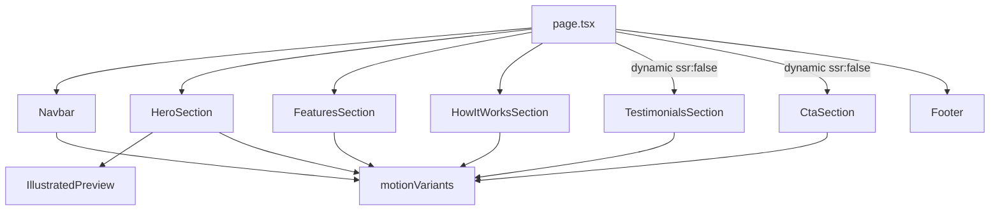

# Design Document: Landing Page UI Redesign

## Overview

This document describes the technical design for the Drawlify landing page UI redesign. The goal is to transform the existing functional but generic landing page into a premium, hand-crafted experience through three pillars: richer Framer Motion animations throughout every section, an expressive inline SVG illustrated preview replacing the static hero image, and an organic visual design language using asymmetric shapes, warm color palettes, and intentional typography.

The redesign is confined to `apps/frontend/app/page.tsx`, `apps/frontend/app/globals.css`, and new component files under `apps/frontend/components/`. No new dependencies are introduced — the existing stack of Next.js 16, React 19, TypeScript, Tailwind CSS v4, Framer Motion v12, and lucide-react is sufficient.

### Key Design Goals

- Replace the `` placeholder with an animated inline SVG that draws itself on mount
- Establish a consistent animation system using shared Framer Motion variants and the `useReducedMotion` hook
- Apply an organic shape language (asymmetric border radii, blob SVG icon containers, dashed SVG timeline connectors) across all sections
- Lazy-load the Testimonials and CTA sections via Next.js dynamic imports to reduce the initial JS bundle
- Maintain WCAG 2.1 AA accessibility throughout

---

## Architecture

### File Structure

```
apps/frontend/
├── app/
│   ├── page.tsx                    # Root landing page — orchestrates all sections
│   └── globals.css                 # Global CSS variables, font declarations, focus ring styles
└── components/
    ├── IllustratedPreview.tsx       # Inline SVG whiteboard preview with pathLength draw-in animation
    ├── Navbar.tsx                   # Frosted-glass fixed navbar with mobile menu
    ├── HeroSection.tsx              # Hero with entrance animations and floating shapes
    ├── FeaturesSection.tsx          # Feature cards with organic shapes and stagger animation
    ├── HowItWorksSection.tsx        # Three-step timeline with SVG dashed connector
    ├── TestimonialsSection.tsx      # Testimonial cards (dynamically imported, ssr: false)
    ├── CtaSection.tsx               # CTA section (dynamically imported, ssr: false)
    ├── Footer.tsx                   # Site footer
    └── motionVariants.ts            # Shared Framer Motion variant definitions
```

The existing `page.tsx` is a single large file with all sections inlined. The redesign extracts each section into its own component file for maintainability, then re-assembles them in `page.tsx`. The `"use client"` directive moves to individual component files that use hooks; `page.tsx` itself becomes a server component that dynamically imports the client-heavy sections.

### Component Dependency Graph



### Dynamic Import Strategy

`TestimonialsSection` and `CtaSection` are loaded via `next/dynamic` with `{ ssr: false }` from `page.tsx`. This keeps their JavaScript out of the initial server-rendered bundle, reducing Time to Interactive for above-the-fold content. A lightweight skeleton placeholder is shown during loading.

```typescript
// page.tsx (server component)
import dynamic from "next/dynamic";

const TestimonialsSection = dynamic(
  () => import("../components/TestimonialsSection"),
  { ssr: false, loading: () => <div className="py-24" /> }
);

const CtaSection = dynamic(
  () => import("../components/CtaSection"),
  { ssr: false, loading: () => <div className="py-24" /> }
);
```

---

## Components and Interfaces

### motionVariants.ts

A central module exporting reusable Framer Motion variant objects and a helper that respects `useReducedMotion`. This avoids duplicating animation config across components.

```typescript
import { Variants } from "framer-motion";

// Entrance animation: opacity + y slide
export const fadeUpVariant: Variants = {
  hidden: { opacity: 0, y: 20 },
  show: {
    opacity: 1,
    y: 0,
    transition: { duration: 0.6, ease: "easeOut" },
  },
};

// Scroll section heading: slightly larger y offset
export const headingVariant: Variants = {
  hidden: { opacity: 0, y: 24 },
  show: {
    opacity: 1,
    y: 0,
    transition: { duration: 0.6, ease: "easeOut" },
  },
};

// Scroll section body: smaller y offset, 60ms delay after heading
export const bodyVariant: Variants = {
  hidden: { opacity: 0, y: 16 },
  show: {
    opacity: 1,
    y: 0,
    transition: { duration: 0.5, ease: "easeOut", delay: 0.06 },
  },
};

// Stagger container for feature cards (80ms between children)
export const featureContainerVariant: Variants = {
  hidden: {},
  show: { transition: { staggerChildren: 0.08 } },
};

// Stagger container for testimonial cards (100ms between children)
export const testimonialContainerVariant: Variants = {
  hidden: {},
  show: { transition: { staggerChildren: 0.1 } },
};

// Individual card child variant
export const cardVariant: Variants = {
  hidden: { opacity: 0, y: 20 },
  show: {
    opacity: 1,
    y: 0,
    transition: { duration: 0.5, ease: "easeOut" },
  },
};

// Reduced-motion override: simple opacity fade, 200ms
export const reducedMotionVariant: Variants = {
  hidden: { opacity: 0 },
  show: { opacity: 1, transition: { duration: 0.2 } },
};

// Spring config for micro-interactions
export const springTransition = { type: "spring", stiffness: 300, damping: 20 };
```

A `useAnimationVariants` hook wraps `useReducedMotion` and returns the appropriate variant set:

```typescript
// hooks/useAnimationVariants.ts
import { useReducedMotion } from "framer-motion";

export function useAnimationVariants(normalVariant: Variants): Variants {
  const prefersReduced = useReducedMotion();
  return prefersReduced ? reducedMotionVariant : normalVariant;
}
```

### Navbar.tsx

**Props:** none
**State:** `open: boolean` (mobile menu toggle)

The navbar is a `"use client"` component. It uses `useReducedMotion` to conditionally disable the mobile menu animation and the navbar CTA hover scale.

Key implementation details:
- Background: `bg-[#fdfbf7]/80 backdrop-blur-[12px]` (Tailwind v4 arbitrary value)
- Nav links: each wrapped in a `<span>` with a `::after` pseudo-element that animates `scaleX` from 0 to 1 on hover via a CSS transition
- "Start Drawing" button: `<motion.a whileHover={{ scale: 1.03 }} whileTap={{ scale: 0.96 }} transition={springTransition}>`
- Mobile menu: `<AnimatePresence>` wrapping a `<motion.div>` with `initial={{ height: 0, opacity: 0 }}`, `animate={{ height: "auto", opacity: 1 }}`, `exit={{ height: 0, opacity: 0 }}`, `transition={{ duration: 0.3, ease: "easeOut" }}`
- Hamburger button: `aria-label="Toggle navigation menu"`, `aria-expanded={open}`
- When `useReducedMotion()` is true, `whileHover` and `whileTap` are set to `{}`

### HeroSection.tsx

**Props:** none
**State:** none (animations are declarative)

The hero uses a staggered entrance sequence. Each element is a `<motion.div>` with `initial="hidden"` and `animate="show"`, using `fadeUpVariant` with explicit `delay` overrides:

| Element | Delay |
|---------|-------|
| Badge | 0ms |
| Headline (h1) | 100ms |
| Subtext (p) | 200ms |
| CTA buttons | 300ms |
| IllustratedPreview | 500ms |

Floating background shapes are absolutely positioned `<motion.div>` elements with `animate` set to a looping `y` oscillation:

```typescript
animate={{ y: [-8, 8, -8] }}
transition={{ duration: 6, repeat: Infinity, repeatType: "mirror", ease: "easeInOut", delay: 0.5 }}
```

Each shape has a unique `delay` between 0–2s and `duration` between 4–12s. Shapes use `aria-hidden="true"`. At least four shapes are rendered with sizes between 40px and 200px and opacity between 0.15 and 0.4.

CTA buttons use `<motion.a whileHover={{ scale: 1.04 }} whileTap={{ scale: 0.96 }} transition={springTransition}>`. When `useReducedMotion()` is true, `whileHover` and `whileTap` are set to `{}`.

### IllustratedPreview.tsx

This is the most technically involved component. It renders an inline SVG depicting a whiteboard scene and animates each path drawing itself in using Framer Motion's `pathLength` motion value.

**Props:** none
**State:** none (animation is declarative)

**SVG Scene Contents:**

The SVG uses `viewBox="0 0 800 450"` (16:9). It contains:

1. **Freehand sketch stroke** — a `<motion.path>` with a wavy, irregular `d` attribute using cubic bezier curves with intentionally imprecise control points. Stroke: `#6c5ce7`, strokeWidth: 3.
2. **Shape outline** — a `<motion.path>` approximating a rounded rectangle with slightly wobbly edges. Stroke: `#fdcb6e`, strokeWidth: 2.5.
3. **Arrow connector** — a `<motion.path>` with a line segment and arrowhead. Stroke: `#00b894`, strokeWidth: 2.
4. **Text label** — a `<motion.text>` element using the Caveat font, fading in with opacity after the paths finish drawing.

**Animation Sequence:**

Each `<motion.path>` is animated with:

```typescript
// path index 0, 1, 2 — stagger of 300ms
initial={{ pathLength: 0, opacity: 0 }}
animate={{ pathLength: 1, opacity: 1 }}
transition={{
  pathLength: { duration: 0.8, ease: "easeInOut", delay: index * 0.3 },
  opacity: { duration: 0.1, delay: index * 0.3 },
}}
```

With 3 paths at 0.3s stagger and 0.8s draw duration, the last path finishes at 0.6 + 0.8 = 1.4s. The text label fades in at `delay: 0.9`. Total animation time is approximately 1.4s, within the 1.5–2.5s requirement.

**Reduced Motion:** When `useReducedMotion()` is true, all paths render with `pathLength: 1` immediately and only the container fades in with a 200ms opacity transition.

**Fallback:** The component renders both the SVG and a fallback paragraph. The fallback is hidden by default and shown via CSS when the SVG has no rendered children:

```tsx
<div className="relative aspect-video">
  <svg role="img" className="illustrated-preview-svg w-full h-full" ...>
    <title>Interactive whiteboard preview showing freehand sketches, shapes, and connectors</title>
    {/* paths */}
  </svg>
  <p className="illustrated-preview-fallback absolute inset-0 flex items-center justify-center text-gray-500 text-sm">
    Interactive whiteboard preview
  </p>
</div>
```

```css
/* globals.css */
.illustrated-preview-fallback { display: none; }
.illustrated-preview-svg:empty ~ .illustrated-preview-fallback { display: flex; }
```

**Accessibility:** The `<svg>` element has `role="img"` and a `<title>` child element.

**Container:** `rounded-2xl overflow-hidden shadow-[0_8px_24px_rgba(0,0,0,0.12)] bg-[#fdfbf7]` with `aspect-video` (16:9 aspect ratio via Tailwind).

### FeaturesSection.tsx

**Props:** none

Feature cards use asymmetric border radii applied via inline style:

```typescript
style={{ borderRadius: "12px 4px 16px 8px" }}
```

Each card has a multi-layer box shadow:

```typescript
style={{
  boxShadow: "3px 3px 0px rgba(0,0,0,0.06), 6px 6px 0px rgba(0,0,0,0.04)",
}}
```

On hover, the card lifts 4px and the shadow intensifies via CSS transition (not Framer Motion, to avoid layout recalculation):

```css
.feature-card:hover {
  transform: translateY(-4px);
  box-shadow: 3px 7px 8px rgba(0,0,0,0.10), 6px 10px 12px rgba(0,0,0,0.06);
  transition: transform 200ms ease, box-shadow 200ms ease;
}
```

**Icon Blob Container:** Each icon is wrapped in an SVG blob shape. The blob is a `<svg viewBox="0 0 100 100">` with a `<path>` defining an organic closed curve, filled with the feature's accent color at 15% opacity. The icon renders on top via absolute positioning within a relative container. Six unique blob paths are pre-computed (one per feature) to avoid runtime computation.

Example blob path:
```
M50,10 C70,5 90,20 95,40 C100,60 85,85 65,90 C45,95 15,85 10,65 C5,45 20,15 50,10 Z
```

The stagger animation uses `featureContainerVariant` on the grid container with `whileInView` and `viewport={{ once: true, amount: 0.2 }}`.

### HowItWorksSection.tsx

**Props:** none

The three steps are rendered in a vertical flex column. Between each pair of steps, a `<svg>` element renders a dashed vertical connector line:

```typescript
<svg width="2" height="48" aria-hidden="true" className="mx-auto">
  <line
    x1="1" y1="0" x2="1" y2="48"
    stroke="#6c5ce7"
    strokeWidth="2"
    strokeDasharray="4 4"
  />
</svg>
```

The connector SVGs sit in the layout flow between step cards in the flex column, naturally connecting them visually.

Each step card uses the same asymmetric border radius as feature cards. The step number is rendered as a large decorative background element:

```typescript
<span
  className="absolute -top-4 -left-2 text-8xl font-bold select-none pointer-events-none"
  style={{ fontFamily: "'Caveat', cursive", opacity: 0.15, color: "#6c5ce7" }}
  aria-hidden="true"
>
  {step.num}
</span>
```

Alternating slide-in animation:

```typescript
initial={{ opacity: 0, x: index % 2 === 0 ? -30 : 30 }}
whileInView={{ opacity: 1, x: 0 }}
viewport={{ once: true, amount: 0.2 }}
transition={{ duration: 0.5, ease: "easeOut", delay: index * 0.15 }}
```

### TestimonialsSection.tsx

**Props:** none
**Dynamic import:** `ssr: false`

Testimonial cards use `testimonialContainerVariant` for stagger. On hover, the card border transitions to full opacity via CSS:

```css
.testimonial-card {
  border-color: rgba(var(--card-border-rgb), 0.3);
  transition: border-color 200ms ease;
}
.testimonial-card:hover {
  border-color: rgba(var(--card-border-rgb), 1.0);
}
```

Each card's `--card-border-rgb` CSS variable is set inline to the appropriate accent color RGB values.

### CtaSection.tsx

**Props:** none
**Dynamic import:** `ssr: false`

The CTA section uses the same floating shape pattern as the hero, with at least two shapes. The gradient background blends `#fdcb6e` and `#00b894` at ~10% opacity over `#fdfbf7`:

```
background: linear-gradient(135deg, rgba(253,203,110,0.10) 0%, rgba(0,184,148,0.10) 100%), #fdfbf7
```

### Footer.tsx

**Props:** none

Static footer with Caveat logo text and copyright. No animations.

---

## Data Models

This feature is purely presentational — there are no new data models, API calls, or state management concerns. The only "data" is the static content arrays for features, steps, and testimonials, which remain as typed constants:

```typescript
// types/landing.ts
export interface Feature {
  icon: string;        // emoji or lucide icon name
  title: string;
  description: string;
  accentColor: string; // hex color from Color_Palette
  blobPath: string;    // pre-computed SVG path for blob container
}

export interface Step {
  num: string;         // "01" | "02" | "03"
  title: string;
  desc: string;
}

export interface Testimonial {
  name: string;
  role: string;
  quote: string;
  borderColor: string; // hex color from Color_Palette
}
```

---

## Correctness Properties

*A property is a characteristic or behavior that should hold true across all valid executions of a system — essentially, a formal statement about what the system should do. Properties serve as the bridge between human-readable specifications and machine-verifiable correctness guarantees.*

This feature is primarily a UI rendering and animation configuration feature. Most acceptance criteria are deterministic configuration checks best validated with example-based tests. However, several criteria express universal constraints that hold across all instances of a class of elements — these are suitable for property-based testing.

**Property Reflection:** After reviewing all testable criteria, 14 non-redundant properties were identified. Properties 3, 4, and 5 test different attributes of floating shapes (delay, opacity, size) and are independent. Properties 6 and 7 test different structural constraints on feature cards (border radius asymmetry vs. shadow layer count). Properties 8 and 9 both test reduced motion behavior but target different animation types (micro-interactions vs. looping animations). All 14 properties provide unique validation value with no redundancy.

### Property 1: Step animation direction alternates by index

*For any* array of how-it-works steps, each step at an even index (0-based) should have an initial `x` animation value of `-30` and each step at an odd index should have an initial `x` animation value of `30`.

**Validates: Requirements 1.4**

### Property 2: Scroll animation durations are within bounds

*For any* scroll-animated element on the landing page, its Framer Motion transition duration should be between 0.4 and 0.7 seconds, and its easing should be `easeOut`.

**Validates: Requirements 1.7**

### Property 3: Floating shape animation delays are within bounds

*For any* floating organic shape element rendered in the Hero or CTA sections, its animation delay should be between 0 and 2 seconds.

**Validates: Requirements 2.4**

### Property 4: Floating shape opacity is within bounds

*For any* floating organic shape element rendered in the Hero or CTA sections, its rendered opacity should be between 0.15 and 0.4.

**Validates: Requirements 2.5**

### Property 5: Floating shape dimensions are within bounds

*For any* floating organic shape element rendered in the Hero or CTA sections, its width and height should each be between 40px and 200px.

**Validates: Requirements 2.6**

### Property 6: Feature card border radii are asymmetric

*For any* feature card rendered in the Features section, no two adjacent corners should share the same border-radius value (the four corner values — top-left, top-right, bottom-right, bottom-left — should not all be equal, and adjacent pairs should differ).

**Validates: Requirements 5.1**

### Property 7: Feature cards have multi-layer box shadows

*For any* feature card rendered in the Features section, its `box-shadow` CSS value should contain at least two comma-separated shadow layers.

**Validates: Requirements 5.2**

### Property 8: Reduced motion disables micro-interactions

*For any* interactive element (button, link, card) rendered when `useReducedMotion()` returns `true`, its `whileHover` and `whileTap` Framer Motion props should be empty objects or undefined, resulting in no scale, translate, or opacity change on hover or tap.

**Validates: Requirements 3.7**

### Property 9: Reduced motion disables looping animations and simplifies entrance animations

*For any* animated element rendered when `useReducedMotion()` returns `true`, looping ambient animations should be absent (no `repeat: Infinity`) and entrance animations should use only opacity with a duration of at most 0.2 seconds.

**Validates: Requirements 8.2**

### Property 10: Headings use Caveat font, body text uses Inter

*For any* `h1` or `h2` element on the landing page, its font family should include `Caveat`. *For any* `p`, caption, or UI label element, its font family should include `Inter`.

**Validates: Requirements 6.1**

### Property 11: Body text color is not lighter than #2d3436

*For any* body text element on the landing page, its text color should have a luminance no greater than that of `#2d3436` (it should be at least as dark).

**Validates: Requirements 6.4**

### Property 12: No section uses pure white background

*For any* `<section>` element on the landing page, its background color should not be `#ffffff` (pure white).

**Validates: Requirements 6.6**

### Property 13: Icon-only buttons have aria-label

*For any* button element that contains only an SVG or icon (no visible text), it should have a non-empty `aria-label` attribute.

**Validates: Requirements 7.4**

### Property 14: Animations use only transform and opacity properties

*For any* Framer Motion animated element on the landing page, its `initial`, `animate`, and `exit` prop objects should only contain keys from the set `{ opacity, x, y, scale, rotate, pathLength }` — no layout-triggering properties such as `width`, `height`, `top`, or `left`.

**Validates: Requirements 8.1**

---

## Error Handling

### IllustratedPreview Fallback

The `IllustratedPreview` component renders both the SVG and a fallback paragraph. The fallback is hidden by default and revealed via CSS when the SVG element is empty (no rendered children):

```tsx
<div className="relative aspect-video rounded-2xl overflow-hidden shadow-[0_8px_24px_rgba(0,0,0,0.12)] bg-[#fdfbf7]">
  <svg role="img" className="illustrated-preview-svg w-full h-full" viewBox="0 0 800 450">
    <title>Interactive whiteboard preview showing freehand sketches, shapes, and connectors</title>
    {/* animated paths */}
  </svg>
  <p className="illustrated-preview-fallback absolute inset-0 flex items-center justify-center text-gray-500 text-sm">
    Interactive whiteboard preview
  </p>
</div>
```

```css
/* globals.css */
.illustrated-preview-fallback { display: none; }
.illustrated-preview-svg:empty ~ .illustrated-preview-fallback { display: flex; }
```

### Dynamic Import Loading States

The `loading` prop on each `dynamic()` call renders a height-preserving placeholder `<div className="py-24" />` to prevent cumulative layout shift (CLS) while the component hydrates on the client.

### Reduced Motion Graceful Degradation

`useReducedMotion` from Framer Motion returns `null` during SSR. The animation helpers treat `null` as `false` (animations enabled) to avoid a flash of unanimated content on first render, then re-evaluate on the client. This is the default behavior of Framer Motion's hook.

### Font Loading Failures

Fonts are loaded via `next/font/google` in `layout.tsx` (already configured for Caveat and Inter). If Google Fonts is unavailable, the CSS variable fallbacks are `cursive` for Caveat and `sans-serif` for Inter, maintaining readability.

---

## Testing Strategy

### Dual Testing Approach

The testing strategy combines example-based unit tests for specific configuration checks with property-based tests for universal constraints. Unit tests catch concrete bugs in specific scenarios; property tests verify general correctness across the full input space.

### Property-Based Testing

**Library:** [fast-check](https://github.com/dubzzz/fast-check) — the standard PBT library for TypeScript/JavaScript.

**Configuration:** Each property test runs a minimum of 100 iterations.

**Tag format:** `// Feature: landing-page-ui-redesign, Property N: <property_text>`

Property tests focus on pure logic functions extracted from components:

- `getStepAnimationX(index: number): number` — returns -30 for even, 30 for odd (Property 1)
- `isValidScrollTransition(duration: number, ease: string): boolean` — validates duration in [0.4, 0.7] and ease is easeOut (Property 2)
- `isValidShapeDelay(delay: number): boolean` — validates delay in [0, 2] (Property 3)
- `isValidShapeOpacity(opacity: number): boolean` — validates opacity in [0.15, 0.4] (Property 4)
- `isValidShapeSize(size: number): boolean` — validates size in [40, 200] (Property 5)
- `hasAsymmetricBorderRadius(borderRadius: string): boolean` — validates no two adjacent corners share the same value (Property 6)
- `hasMultiLayerShadow(boxShadow: string): boolean` — validates at least two comma-separated layers (Property 7)
- `getMicroInteractionProps(reducedMotion: boolean): MotionProps` — validates empty whileHover/whileTap when reduced (Property 8)
- `getEntranceAnimationProps(reducedMotion: boolean): MotionProps` — validates opacity-only, <=0.2s when reduced (Property 9)
- `getFontForElement(elementType: string): string` — validates Caveat for headings, Inter for body (Property 10)
- `isColorDarkEnough(hexColor: string): boolean` — validates luminance <= luminance(#2d3436) (Property 11)
- `isWarmBackground(hexColor: string): boolean` — validates color !== #ffffff (Property 12)
- `buttonHasAriaLabel(buttonProps: ButtonProps): boolean` — validates non-empty aria-label on icon-only buttons (Property 13)
- `getAnimationPropKeys(motionProps: object): string[]` — validates only allowed keys present (Property 14)

### Unit Tests

Example-based tests cover:

- **Navbar:** mobile menu toggle renders correctly, frosted glass styles applied, "Start Drawing" button has correct whileHover/whileTap props, hamburger has aria-label and aria-expanded
- **IllustratedPreview:** renders an `<svg>` element, has `role="img"`, has `<title>` child, fallback renders when SVG is empty, pathLength animation props are set on each path with correct stagger
- **HeroSection:** renders 4+ floating shapes, each shape has `aria-hidden="true"`, entrance animation delays are in correct sequence (0ms, 100ms, 200ms, 300ms, 500ms)
- **FeaturesSection:** renders 6 cards, each card has blob icon container, card background is `#f5f1eb`, stagger uses 80ms delay
- **HowItWorksSection:** renders 2 SVG dashed connector lines between 3 steps, step numerals have opacity in [0.1, 0.25], connector lines use `strokeDasharray`
- **TestimonialsSection:** dynamically imported with `ssr: false`, stagger uses 100ms delay
- **CtaSection:** dynamically imported with `ssr: false`, renders 2+ floating shapes, gradient background uses two Color_Palette accent colors
- **Accessibility:** all icon-only buttons have `aria-label`, all decorative SVGs have `aria-hidden="true"`, IllustratedPreview SVG has `role="img"` and `<title>`

### Integration / Visual Tests

For layout and visual correctness that cannot be verified with unit tests:

- **Playwright visual regression tests** at 320px, 768px, and 1440px viewport widths to catch overflow and layout issues (Requirement 7.1)
- **Axe accessibility audit** integrated into Playwright tests to verify WCAG 2.1 AA contrast ratios and focus ring visibility (Requirements 7.5, 7.6)
- **Animation smoke test:** verify that the IllustratedPreview pathLength draw-in animation completes within 2.5s using Playwright's `waitForSelector` with a timeout

### Test File Locations

```
apps/frontend/
└── __tests__/
    ├── landing/
    │   ├── IllustratedPreview.test.tsx
    │   ├── Navbar.test.tsx
    │   ├── HeroSection.test.tsx
    │   ├── FeaturesSection.test.tsx
    │   ├── HowItWorksSection.test.tsx
    │   ├── TestimonialsSection.test.tsx
    │   ├── CtaSection.test.tsx
    │   └── accessibility.test.tsx
    └── properties/
        ├── animationConfig.property.test.ts
        ├── shapeConfig.property.test.ts
        ├── cardStyle.property.test.ts
        ├── reducedMotion.property.test.ts
        └── colorContrast.property.test.ts
```
